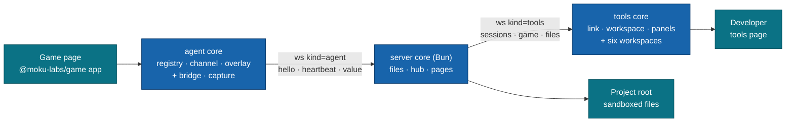
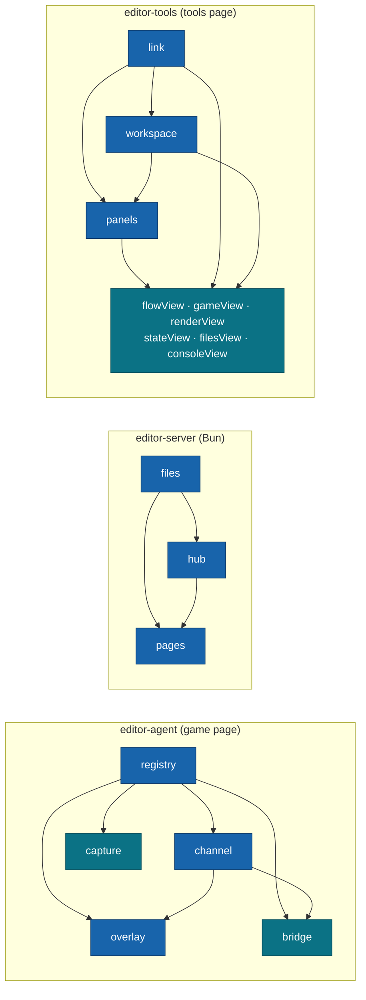
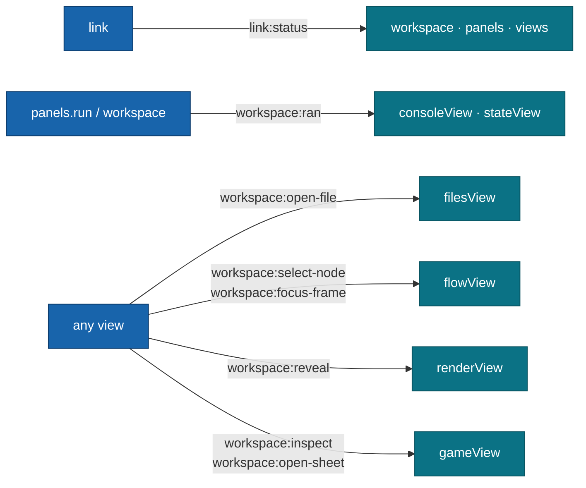

# @moku-labs/editor

**Devtools for a running `@moku-labs/game`: see the flow, the state, the render and the files of the live game, and change them, from one tools page.**

One registry of sources and commands feeds everything: the in-game overlay, the tools page served by the dev server, and headless tests. The editor reaches the game only through its two doors, `@moku-labs/game/inspect` and `@moku-labs/game/control` — no private hooks into the engine, no engine fork. It is a dev dependency, not a runtime: nothing of it has to ship in a production build.

<br/>

[](https://www.npmjs.com/package/@moku-labs/editor)
[](#requirements)
[](#requirements)
[](#install)
[](https://github.com/moku-labs/core)
[](./LICENSE)

<br/>

[Install](#install) · [Quick start](#quick-start) · [How it works](#how-it-works) · [The three cores](#the-three-cores) · [Plugins](#plugins) · [Configuration](#configuration) · [Events](#events) · [Wire protocol](#wire-protocol) · [Scripts](#scripts) · [Docs](#docs)

---

## Why @moku-labs/editor

- **One registry, every surface.** A source or command is declared once in the agent's `registry`; the overlay, the tools page and a test all read it the same way — through an `EditorChannel`. No second code path to keep in sync.
- **Doors, not hooks.** The editor touches the game only through `@moku-labs/game/inspect` and `@moku-labs/game/control`, plus the game's own `.dev` modules. If the engine does not expose it, the editor does not see it.
- **Three runtimes, three cores.** The game page, the Bun server and the tools page each get their own Moku core with their own events (`editor-agent`, `editor-server`, `editor-tools`). Bun code never reaches the browser; Preact never reaches the server.
- **A panel is data.** `definePanel` returns a frozen spec of sources, commands and a view. The `panels` host owns every subscription, stale marking and teardown — views never poll.
- **Edits without engine HMR.** Saving a style or a node writes the file, bookmarks the game, reloads the frame and restores the bookmark. "Game reloaded · state restored from the last checkpoint."
- **Loopback and sandboxed by construction.** The server binds `127.0.0.1` only, checks Host, Origin and a per-start token before any upgrade, and `files` reads and writes only inside one project root and an allowlist. No shell, no spawned processes.

## Install

```sh
bun add -d @moku-labs/editor @moku-labs/game
```

> [!NOTE]
> **Status: `0.x` — early.** The API can change between minor versions. `@moku-labs/game >= 0.0.2` is a **peer dependency**; `game.effects` in the Render workspace needs game `0.0.3`.
>
> **Breaking in this release:** Notes are gone (`flowView.notes`, the gameView attach api, the `notesDir` options of flowView and gameView, the `workspace:new-note` event). Game is the default workspace, and ⌘1 to ⌘6 follow the new rail order.

> [!IMPORTANT]
> The server core and the `moku-editor` bin run on **Bun** (`Bun.serve`, HTML imports). The agent and tools cores run in the browser. The package is **ESM only**.

## Quick start

Three pieces: the **agent** on the game page, the **server** in Bun, the **tools page** in a browser tab.

**1. Wire the agent into the game page — dev only.** The default agent plugins are `registry`, `channel` and `overlay`. The websocket `bridgePlugin` and the screenshot `capturePlugin` are opt-in, so a dev entry adds them behind the engine's dev flag:

```ts
import { bridgePlugin, capturePlugin, createApp } from "@moku-labs/editor/agent";

const devPlugins = __MOKU_GAME_DEV__ ? [bridgePlugin, capturePlugin] : [];
const editor = createApp({
  plugins: devPlugins,
  pluginConfigs: { registry: { game: app, modules: [mergeDev], name: "merge-game 0.0.0" } }
});
await editor.start(); // never waits for the editor server
```

`app` is the game made with `createApp` from `@moku-labs/game`; `modules` are the game's `.dev` modules (extra sources and commands). `__MOKU_GAME_DEV__` is the engine's dev flag: a dev build defines it `true`.

**2. Run the server.** The quickest way is the bin — it serves one game HTML file with the editor mounted:

```sh
bunx moku-editor web/index.html --port 3000 --root .
```

```
Game   http://127.0.0.1:3000/
Tools  http://127.0.0.1:3000/__editor/
Root   /Users/alex/game
```

Or wrap the game's own `Bun.serve` with the server core:

```ts
import { createApp } from "@moku-labs/editor/server";
import index from "./index.html";

const editor = createApp({ pluginConfigs: { files: { root: `${import.meta.dir}/..` } } });
await editor.start();
Bun.serve(editor.hub.serve({ port: 3000, routes: { "/": index }, fetch: serveAsset }));
```

**3. Open the tools page** at `http://127.0.0.1:3000/__editor/`. It ships prebuilt in `dist/tools/` and embeds the game at `gameUrl` (default `/`). The link pill goes `connecting` → `live · frame N` as soon as the game page's bridge says `hello`.

**In a narrow pane.** The tools page is built to sit next to a chat, in Claude's browser pane at
1/2 (720 px) or 1/3 (480 px) of the screen. Game is the first workspace and the default
(⌘1 Game, ⌘2 Flow, then Render, State, Files, Console). Density is `auto` (compact below 820 px of
window width), `compact` or `comfortable`, chosen in the palette ("Density: …") and saved with the
theme. **Reference mode** (key R, or the target button in the top bar) lays `data-moku-*` proxies
over the game elements, so whoever reads the page can name them; the game gets no input while it
is on, and the Element tab's "Copy reference" copies one `@moku …` line for the chat.

> [!TIP]
> The tools page is itself a Moku app (`src/plugins/pages/page/main.tsx`). To compose your own, start the tools core and mount the shell:
> ```ts
> const tools = createApp({});
> await tools.start();
> tools.workspace.mount(document.querySelector<HTMLElement>("[data-editor-root]")!);
> ```

## How it works



1. The **agent** wraps the game's doors into closure-erased registry entries — raw `Json` in, checked input to the door, wire-safe `Json` out — and builds a `Manifest`.
2. The **bridge** fetches `{path}/hello` for `{ ws, token }`, opens the socket with `kind=agent`, sends `hello { manifest }`, then a `heartbeat` every `heartbeatMs`.
3. The **hub** opens a session (`s-` + 4 hex), emits `hub:session`, routes `game` requests from tools connections to the chosen session and `files` requests to the `files` sandbox. One agent-side watch is shared by every tools subscriber.
4. The **link** on the tools page reads the boot JSON `pages` injected, picks a session, caches its manifest and exposes the remote `EditorChannel`. Every panel reads through it.

The game page and the tools page never talk directly. The game frame inside the tools page is a plain same-origin iframe that runs its own agent.

### Plugin graph per core



Arrows point from a dependency to the plugin that requires it. Teal = opt-in (`bridge`, `capture`) or a leaf (the views). `stateView` does not require `workspace`. **No view depends on another view**: cross-view requests are global tools events.

### Event flow (tools core)



## The three cores

`src/config.ts` holds three `createCoreConfig` calls; each subpath entry calls `createCore` for its own core. Every core registers the core plugins `log` and `env` from `@moku-labs/common`, so `ctx.log` and `ctx.env` exist on every plugin context.

| Entry | Core name | Runtime | Default plugins | Opt-in |
|---|---|---|---|---|
| `@moku-labs/editor/agent` | `editor-agent` | game page (browser) or headless Bun | `registry`, `channel`, `overlay` | `bridgePlugin`, `capturePlugin` |
| `@moku-labs/editor/server` | `editor-server` | Bun | `files`, `hub`, `pages` | — |
| `@moku-labs/editor/tools` | `editor-tools` | tools page (browser) | `link`, `workspace`, `panels`, `flowView`, `gameView`, `renderView`, `stateView`, `filesView`, `consoleView` | — |
| `@moku-labs/editor` | — | anywhere | Runtime-free: the wire protocol (types and pure helpers) and `definePanel` | — |

Each entry exports `createApp`, `createPlugin`, its plugin instances and their types as namespaces (`Registry.RegistryApi`, `Hub.HubSession`, `Workspace.WorkspaceId`, …).

### `createApp` and `pluginConfigs`

Options are per plugin, set through `pluginConfigs` and shallow-merged over the defaults (an array replaces the default). Bad values throw at `createApp` with a `[moku-editor] <plugin>.<field> …` message and a fix line.

```ts
// agent: a QA build with the overlay open at start
const editor = createApp({
  pluginConfigs: { registry: { game }, overlay: { open: true, corner: "bottom-left" } }
});

// server: open files in Cursor instead of VS Code
const server = createApp({
  pluginConfigs: {
    files: { root: `${import.meta.dir}/..` },
    pages: { editorUrl: "cursor://file/{path}:{line}" }
  }
});

// tools: start on the Flow workspace (Game is the default)
const tools = createApp({ pluginConfigs: { workspace: { defaultWorkspace: "flow" } } });
```

### Reaching plugin APIs

From the app, every plugin's api is mounted under its name. From another plugin, use `ctx.require(plugin)`.

```ts
await editor.channel.run("game.step", { frames: 1 }); // agent
editor.bridge.status(); // { kind: "live", frame: 1840 }

editor.hub.sessions(); // server: [{ id: "s-7f3a", game: "merge-game 0.0.0", … }]
await editor.files.list("src");

const ran = await tools.link.run("game.step", { frames: 1 }); // tools: ran.state.frame === 1841
tools.workspace.show("game");
await tools.gameView.capture(); // { path: ".moku/captures/2026-09-24-1012-board.png", … }
```

### Writing a plugin

Each entry exports `createPlugin`, bound to that core's Config and Events.

```ts
// agent: a game's own editor command
import { createPlugin, registryPlugin } from "@moku-labs/editor/agent";
export const pingPlugin = createPlugin("ping", { depends: [registryPlugin], onInit: addPing });
// in addPing: ctx.require(registryPlugin).add({ descriptor, run });

// server: react to sessions
import { createPlugin, hubPlugin } from "@moku-labs/editor/server";
export const auditPlugin = createPlugin("audit", {
  depends: [hubPlugin],
  hooks: ctx => ({
    "hub:session": session => ctx.log.info("audit:session", { id: session.id, open: session.open })
  })
});
```

A tools view is a plugin that registers a `definePanel` spec with `panels` in its `onInit`:

```ts
import { definePanel } from "@moku-labs/editor";

export const statePanel = definePanel({
  id: "state", title: "State", workspace: "state",
  sources: { model: "game.model", position: "game.position", history: ["game.history", { last: 1 }] },
  view: (values, tools) => h(StateView, { values, tools })
});
// in the view plugin's onInit
ctx.require(panelsPlugin).register(statePanel);
```

## Plugins

All 17, in core order. Tiers follow the Moku plugin tiers. Each name links to its README.

| Plugin | Core | Tier | Purpose | Key APIs |
|---|---|---|---|---|
| [`registry`](src/plugins/registry/README.md) | agent | Complex | The only place the editor touches the game's doors. Wraps doors, `.dev` modules and `editor.*` commands into entries; builds the `Manifest`; owns the runtime-free protocol. | `manifest`, `source`, `command`, `add`, `envelope`, `clock` |
| [`channel`](src/plugins/channel/README.md) | agent | Standard | The in-process `EditorChannel`: immediate read on watch, runs off the frame loop, a timer heartbeat that beats while paused. | `read`, `watch`, `run`, `status`, `heartbeat`, `onHeartbeat` |
| [`overlay`](src/plugins/overlay/README.md) | agent | Standard | A small Preact card over the game: render chips and one-click cheats. Off by default. | `open`, `close`, `isOpen`; command `editor.overlay` |
| [`bridge`](src/plugins/bridge/README.md) | agent, opt-in | Complex | The websocket from the game page to the hub: hello, requests, throttled values, backoff reconnect. | `status`, `session` |
| [`capture`](src/plugins/capture/README.md) | agent, opt-in | Standard | Screenshots on demand, never on its own. | commands `editor.capture`, `editor.series`, `editor.seriesStop` |
| [`files`](src/plugins/files/README.md) | server | Standard | The project-root sandbox: list, read, atomic write with version check, image captures. | `list`, `read`, `write`, `writeBinary`, `readBinary`, `resolve`, `root` |
| [`hub`](src/plugins/hub/README.md) | server | Complex | The websocket switchboard: guard and token, sessions, routing, fan-out, backpressure. Wraps `Bun.serve`. | `serve`, `token`, `sessions`, `fetch`, `websocket`, `addRoutes`, `guard`, `path` |
| [`pages`](src/plugins/pages/README.md) | server | Standard | Serves the prebuilt tools page with its boot JSON, its assets and the `hello` route. Home of the `moku-editor` bin. | `routes` |
| [`link`](src/plugins/link/README.md) | tools | Complex | The tools page's only connection: boot JSON, one socket, session choice, the remote `EditorChannel`, the files client, the link status. | `read`, `watch`, `run`, `status`, `manifest`, `onManifest`, `sessions`, `choose`, `retry`, `boot`, `files` |
| [`workspace`](src/plugins/workspace/README.md) | tools | Complex | The shell: top bar, rail, palette, toasts, keys and Esc, preferences, the one game iframe and the D-07 reload. | `show`, `gameFrame`, `palette`, `toast`, `keys`, `mount`, `host`, `setOverlayInGame` |
| [`panels`](src/plugins/panels/README.md) | tools | Standard | The panel host: watches sources, waits for first values, stale marking, re-checks on manifest change. Holds `shared/` view modules. | `register`, `run`, `list`, `mountInto` |
| [`flowView`](src/plugins/flowView/README.md) | tools | VeryComplex | The Flow workspace: a canvas of the flow graph with ELK layout, focus, trail, code and style inspector. | `camera`, `focus`, `flows`, `layout` |
| [`gameView`](src/plugins/gameView/README.md) | tools | Complex | The Game workspace (the default): device stage, element picker, style card, Reference mode proxies, screenshots, series and the contact sheet. | `pick`, `inspect`, `scene`, `locate`, `capture`, `series`, `openSheet` |
| [`renderView`](src/plugins/renderView/README.md) | tools | Standard | The Render workspace: metric tiles, render tree, textures, bundles, pools, release log. | `snapshot`, `reveal`, `highlight`, `sortTextures`, `filterBundle`, `refresh` |
| [`stateView`](src/plugins/stateView/README.md) | tools | Standard | The State workspace: player and session trees, the last commit derived by diffing `game.model`, the runner. | `lastCommit`, `onCommit`, `note`, `tainted`, `expandAll` |
| [`filesView`](src/plugins/filesView/README.md) | tools | Complex | The Files workspace: project tree, tabs, viewer, in-place editor, previews, conflict bar, Used by. | `open`, `save`, `resolveConflict`, `fileOf`, `usedBy`, `editorUrl` |
| [`consoleView`](src/plugins/consoleView/README.md) | tools | Standard | The Console workspace: `game.log` as a table, level filter, search, Preserve log, command errors, rail badge. | `lines`, `visible`, `counts`, `setFilter`, `clear`, `focusFrame` |

## Configuration

Every option belongs to a plugin; the three global configs (`AgentConfig`, `ServerConfig`, `ToolsConfig`) are empty. Defaults below come from each plugin's `index.ts`.

**Agent**

| Plugin | Option | Default | Meaning |
|---|---|---|---|
| registry | `game` | `undefined` | **Required.** The app the game made with `createApp`. |
| registry | `modules` | `[]` | The game's `.dev` modules, merged after the doors. |
| registry | `name` | `undefined` | `Manifest.game`. Falls back to `document.title`, then `"game"`. |
| channel | `heartbeatMs` | `1000` | Ms between two beats. Whole number ≥ 100. |
| overlay | `open` | `false` | Open at start. |
| overlay | `corner` | `"top-right"` | Corner of the game page. |
| overlay | `mount` | `undefined` | CSS selector of the host's parent; `undefined` = `document.body`. |
| bridge | `hello` | `"/__editor/hello"` | Hello route: same-origin path or absolute URL. |
| bridge | `retryMs` | `1000` | First reconnect delay; doubles up to 30 s, ±20 % jitter. |
| bridge | `callTimeoutMs` | `5000` | Deadline of one `read` or `run`. |
| capture | `maxDurationMs` | `20000` | Longest series accepted. |
| capture | `minIntervalMs` | `16` | Shortest series interval accepted. |

**Server**

| Plugin | Option | Default | Meaning |
|---|---|---|---|
| files | `root` | `"."` | Project root; must be an existing folder. |
| files | `allow` | `["**/*.ts", "**/*.tsx", "**/*.json", "**/*.md", "**/*.css", ".moku/**"]` | Globs a file must match. Case-sensitive. |
| files | `deny` | `["**/node_modules/**", "**/.git/**", "**/dist/**", "**/.env*"]` | Globs never listed, read or written. Case-insensitive. |
| hub | `path` | `"/__editor"` | URL prefix of every editor route. |
| hub | `allow` | `[]` | Extra exact origins allowed, e.g. `"http://192.168.1.4:3000"`. |
| hub | `callTimeoutMs` | `5000` | Deadline of a forwarded call. |
| hub | `silentAfterMs` | `6000` | No heartbeat this long → silent (65 s after a paused beat). |
| pages | `title` | `"moku editor"` | Tools page `<title>`. |
| pages | `editorUrl` | `"vscode://file/{path}:{line}"` | "Open in editor" link template. |
| pages | `pageDir` | `undefined` | Built page folder; `undefined` = `dist/tools` next to the module. |
| pages | `gameUrl` | `"/"` | Same-origin URL of the game page the tools page embeds. |

**Tools**

| Plugin | Option | Default | Meaning |
|---|---|---|---|
| link | `retryMs` | `1000` | Base of the reconnect backoff, capped at 8 s. |
| link | `boot` | `"#moku-editor-boot"` | Selector of the boot JSON tag. |
| workspace | `defaultWorkspace` | `"game"` | Shown at start when the hash names none. |
| workspace | `storageKey` | `"moku-editor"` | localStorage key of the preferences. |
| workspace | `reloadTimeoutMs` | `15000` | How long `reload()` waits for the new session. |
| workspace | `toastMs` | `2600` | How long one toast stays. |
| panels | — | `{}` | No options. |
| flowView | `historyLast` · `trailLength` · `rejectedOutcomes` | `20` · `6` · `["rejected"]` | History watched, trail edges, rejection outcomes. |
| flowView | `hubMinOutcomes` · `hubMinReturns` | `6` · `4` | The hub rule. |
| flowView | `layoutFile` · `stylesFile` | `".moku/editor/layout.json"` · `undefined` | Saved positions; the text styles file (unset: the first file that calls `defineTextStyles(`, found once per session). |
| flowView | `layoutWorker` · `layoutSaveDelayMs` · `styleSaveDelayMs` | `true` · `400` · `600` | ELK in a worker, save debounces. |
| flowView | `minZoom` · `maxZoom` · `defaultMinZoom` | `0.08` · `3` · `0.8` | Zoom range and default camera floor. |
| gameView | `capturesDir` | `".moku/captures"` | Where captures go. |
| gameView | `manifestPaths` | `["manifest.json", "public/manifest.json", "web/manifest.json"]` | Asset manifest candidates. |
| gameView | `captureCardMs` · `seriesWarnShots` | `10000` · `200` | Capture card timeout, series warning. |
| gameView | `seriesDurationsMs` · `seriesIntervalsMs` | `[1000, 2000, 5000, 10000, 20000]` · `[16, 50, 100, 250, 500, 1000]` | Series popover chips. |
| gameView | `sourceSearch` | `{ maxFiles: 400, skip: ["node_modules", "dist", ".git", ".moku"] }` | Style-block search of a picked element. |
| renderView | `fpsSamples` · `releaseLogMax` | `60` · `50` | Sparkline samples, release log size. |
| renderView | `manifestPaths` | `["manifest.json", "public/manifest.json", "web/manifest.json"]` | Asset manifest candidates. |
| stateView | `expandDepth` · `maxPatches` · `pageSize` | `2` · `200` · `100` | Tree depth open, patches kept, children per page. |
| filesView | `maxFiles` · `maxHighlightChars` | `5000` · `512000` | Index cap, highlight cap. |
| filesView | `reloadExtensions` · `revalidateMs` | `[".ts", ".tsx", ".css", ".json"]` · `2000` | Saves that reload the game, tab re-read age. |
| consoleView | `maxLines` · `preserveLog` | `5000` · `false` | Lines kept, Preserve log at start. |
| consoleView | `freshMs` · `summaryChars` | `1200` · `160` | Fresh-error highlight, inline data length. |

## Events

Global events are declared per core in `src/config.ts`. No plugin declares its own `events`.

| Core | Event | Payload | Emitted by | Hooked by |
|---|---|---|---|---|
| agent | `bridge:status` | `{ status: LinkStatus; session?: string }` | bridge | overlay |
| server | `hub:session` | `HubSession` = `{ id, game, open, reason?: "bye" \| "game_reloaded" }` | hub | — (for consumer plugins) |
| server | `files:written` | `FilesWritten` = `{ path, bytes, kind: WrittenKind }` | files | — (for a later MCP layer) |
| tools | `link:status` | `{ status: LinkStatus; session?: string }` | link | workspace, panels, all six views |
| tools | `workspace:changed` | `{ ws: WorkspaceId }` | workspace | panels, flowView, gameView, renderView, filesView |
| tools | `workspace:ran` | `RanEvent` = `{ id, input, origin, at } & ({ ok: true, result } \| { ok: false, error })` | workspace, panels | stateView, consoleView |
| tools | `workspace:density` | `{ density: "compact" \| "comfortable" }` | workspace | flowView |
| tools | `workspace:reference` | `{ on: boolean }` | workspace | gameView |
| tools | `workspace:open-file` | `{ path: string; line?: number }` | flowView, gameView | filesView |
| tools | `workspace:select-node` | `{ id: string }` | filesView | flowView |
| tools | `workspace:focus-frame` | `{ frame: number }` | consoleView | flowView |
| tools | `workspace:reveal` | `{ ref: ElementRef }` | gameView | renderView |
| tools | `workspace:inspect` | `{ ref: ElementRef }` | renderView | gameView |
| tools | `workspace:open-sheet` | `{ index: string }` | filesView | gameView |

`LinkStatus` is `connecting` · `live { frame }` · `paused { frame }` · `silent { since, lastFrame }` · `lost { reason, lastFrame, retryInMs }` · `empty`. The bridge only ever reports `connecting`, `live`, `paused` and `lost`; `silent` and `empty` are tools-side states.

## Wire protocol

JSON-RPC 2.0 text frames with a `channel` (`game`, `files`, `editor`) and, for forwarded game traffic, a `session`. Everything is exported from the package root — `encode`, `decode`, `request`, `notification`, `success`, `failure`, `checkInput`, `toWireValue`, `wireError`, `isRetryable`, `bareMessage` and the types.

| Code | `errorCode` key | `data.reason` | Retryable |
|---|---|---|---|
| -32600 | `invalidRequest` | — | no |
| -32601 | `unknownMethod` | `unknown_id` for an unknown source or command | no |
| -32602 | `invalidInput` | `invalid_input` (`data.field` names the field) | no |
| -32000 | `commandFailed` | `command_failed` | no |
| -32001 | `gameReloaded` | `game_reloaded` | yes |
| -32002 | `timeout` | `timeout`, or `link_closed` on the tools side | yes |
| -32003 | `noSession` | `no_session`, `choose_session` | no |
| -32004 | `forbiddenPath` | `forbidden_path` | no |
| -32005 | `versionConflict` | `version_conflict` | no |
| -32006 | `notJson` | `not_json` | no |
| -32007 | `unauthorized` | `unauthorized` | no |

Every message starts with `[moku-editor] ` (`ERROR_PREFIX`); no stack ever crosses the wire. A run of `editor.series` gets its `durationMs` (capped at +60 s) on top of the deadline in bridge, hub and link alike.

## Scripts

```sh
bun run build              # tsdown (ESM) + build:tools (the prebuilt tools page in dist/tools)
bun run build:tools        # bundle src/plugins/pages/page with Bun.build
bun run typecheck          # tsc --noEmit
bun run test               # every vitest project
bun run test:unit          # unit tests only
bun run test:integration   # integration tests only
bun run test:coverage      # unit + integration with coverage (90 % threshold)
bun run lint               # Biome check + ESLint
bun run lint:fix           # auto-fix lint issues
bun run format             # Biome format
bun run validate           # publint + attw (esm-only profile)
```

**Tests.** Plugin tests sit next to each plugin in `src/plugins/<name>/__tests__/unit/` and `__tests__/integration/`. Root tests in `tests/integration/` run the whole stack over the real wire: `startStack()` (`tests/integration/helpers/stack.ts`) creates a tiny project, starts the server core on a real `Bun.serve`, installs the page, starts an agent on a **tiny game** built from the `@moku-labs/game` dev dependency, boots the tools app and waits for a live link with a manifest. The tiny-game journeys run in CI.

**Local merge-game tests.** The merge-game tests load the fixture from a pinned checkout of the game repository, not from the live `../game`. The checkout is a detached worktree at `../game-fixture`, on the tag that matches the `@moku-labs/game` dev dependency in `package.json`. Create it once, with its dependencies:

```sh
git -C ../game fetch --tags && git -C ../game worktree add --detach ../game-fixture v0.1.0
bun install --cwd ../game-fixture --frozen-lockfile --ignore-scripts
```

When `package.json` bumps `@moku-labs/game`, move it and install again: `git -C ../game-fixture checkout vX.Y.Z`, then the `bun install` line. To use another checkout, set `MOKU_GAME_DIR` (absolute, or relative to this repository): `MOKU_GAME_DIR=../my-game bun run test`. The rule lives in `tests/fixtures/game-dir.ts`. CI has no checkout, so `vitest.config.ts` skips those test files there with a warning.

## Requirements

- **Node `>= 24`** and **Bun `>= 1.3.14`** — use `bun` exclusively (never npm/yarn/pnpm). The server core and the bin need Bun.
- **TypeScript** in strict mode, with `exactOptionalPropertyTypes` and `noUncheckedIndexedAccess`.
- **[`@moku-labs/game`](https://github.com/moku-labs/game) `>= 0.0.2`** — the peer the editor inspects and controls.
- Built on **[`@moku-labs/core`](https://github.com/moku-labs/core)** and **[`@moku-labs/common`](https://github.com/moku-labs/common)** (`log`, `env`, the branded CLI); views use **Preact**, Flow layout uses **elkjs**.

## Docs

- Per-plugin READMEs: [registry](src/plugins/registry/README.md) · [channel](src/plugins/channel/README.md) · [overlay](src/plugins/overlay/README.md) · [bridge](src/plugins/bridge/README.md) · [capture](src/plugins/capture/README.md) · [files](src/plugins/files/README.md) · [hub](src/plugins/hub/README.md) · [pages](src/plugins/pages/README.md) · [link](src/plugins/link/README.md) · [workspace](src/plugins/workspace/README.md) · [panels](src/plugins/panels/README.md) · [flowView](src/plugins/flowView/README.md) · [gameView](src/plugins/gameView/README.md) · [renderView](src/plugins/renderView/README.md) · [stateView](src/plugins/stateView/README.md) · [filesView](src/plugins/filesView/README.md) · [consoleView](src/plugins/consoleView/README.md)
- Tools page styles: [workspace/styles](src/plugins/workspace/styles/README.md)
- LLM docs: [`llms.txt`](./llms.txt) (overview) · [`llms-full.txt`](./llms-full.txt) (every Config, Api and event type verbatim)
- [Moku Core specification](https://github.com/moku-labs/core/tree/main/specification)

## License

[MIT](./LICENSE) © [moku-labs](https://github.com/moku-labs)
