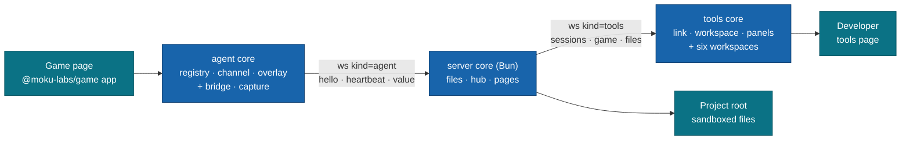
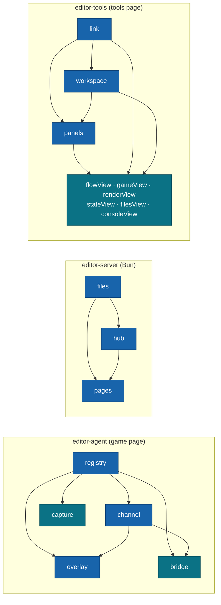
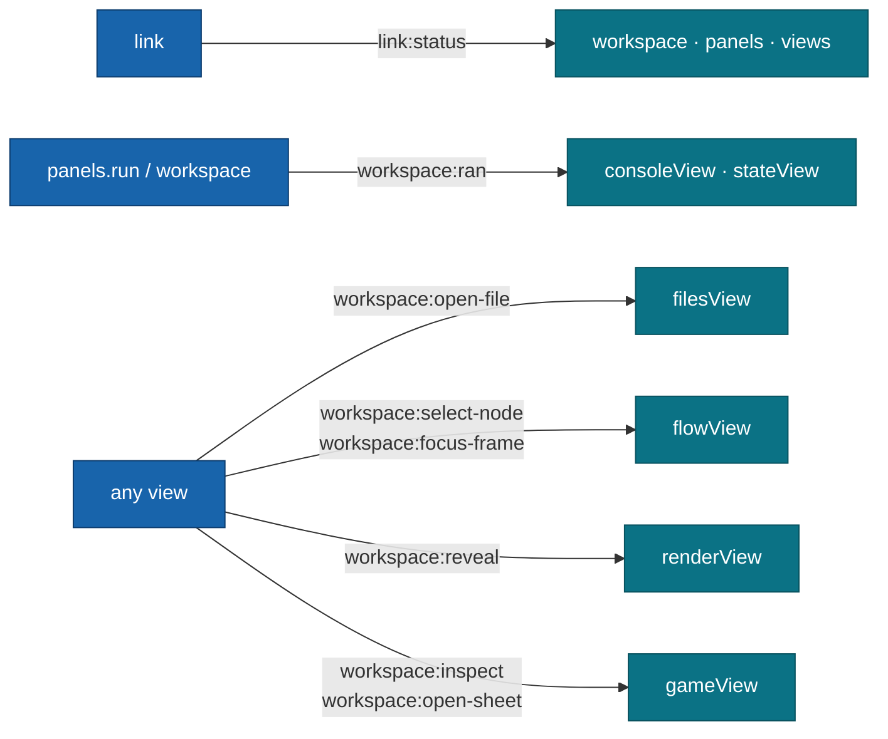

# @moku-labs/editor

**Devtools for a running `@moku-labs/game`: see the flow, the state, the render and the files of the live game, and change them, from one tools page.**

One registry of sources and commands feeds everything: the in-game overlay, the tools page served by the dev server, and headless tests. The editor reaches the game only through its two doors, `@moku-labs/game/inspect` and `@moku-labs/game/control` — no private hooks into the engine, no engine fork. It is a dev dependency, not a runtime: nothing of it has to ship in a production build (see [Production builds](#production-builds)).

<br/>

[](https://www.npmjs.com/package/@moku-labs/editor)
[](#requirements)
[](#requirements)
[](#install)
[](https://github.com/moku-labs/core)
[](./LICENSE)

<br/>

[Install](#install) · [Quick start](#quick-start) · [Use with Claude Code](#use-with-claude-code) · [The tools page](#the-tools-page) · [Production builds](#production-builds) · [How it works](#how-it-works) · [The three cores](#the-three-cores) · [Plugins](#plugins) · [Configuration](#configuration) · [Events](#events) · [Wire protocol](#wire-protocol) · [Scripts](#scripts) · [Docs](#docs)

---

## Why @moku-labs/editor

- **One registry, every surface.** A source or command is declared once in the agent's `registry`; the overlay, the tools page and a test all read it the same way — through an `EditorChannel`. No second code path to keep in sync.
- **Doors, not hooks.** The editor touches the game only through `@moku-labs/game/inspect` and `@moku-labs/game/control`, plus the game's own `.dev` modules. If the engine does not expose it, the editor does not see it.
- **Three runtimes, three cores.** The game page, the Bun server and the tools page each get their own Moku core with their own events (`editor-agent`, `editor-server`, `editor-tools`). Bun code never reaches the browser; Preact never reaches the server.
- **A panel is data.** `definePanel` returns a frozen spec of sources, commands and a view. The `panels` host owns every subscription, stale marking and teardown — views never poll.
- **Edits keep the game state.** With Bun hot reload on (the bin's default), a save of a game source reloads the game page and the bridge restores the bookmark it took just before: "Game reloaded · state restored", in about a second on merge-game. Without hot reload the editor bookmarks, reloads the frame and restores it itself (D-07).
- **Loopback and sandboxed by construction.** The server binds `127.0.0.1` only, checks Host, Origin and a per-start token before any upgrade, and `files` reads and writes only inside one project root and an allowlist. The server runs no shell and spawns nothing. Only the MCP bridge starts a process: the bin, when none runs, and it stops only that one.

## Install

```sh
bun add -d @moku-labs/editor @moku-labs/game
```

> [!NOTE]
> **Status: `0.x` — early.** The API can change between minor versions. `@moku-labs/game >= 0.1.0` is a **peer dependency**.
>
> **Compatibility:** works with @moku-labs/game 0.1.x and 0.4.x. The views read element rects from `game.locate` when the game lists it (0.4), else from `game.rect` (0.1); a game with neither makes the picker say "This game reports no element rects". `game.capture` may answer the PNG data URL (0.1) or `{ png, legend? }` (0.4): `editor.capture`, `editor.series` and the Game Shot and Series take both. The contact sheet `editor.sheet` (MCP `moku_series`) needs game 0.4.
>
> **Breaking in this release:** Notes are gone (`flowView.notes`, the gameView attach api, the `notesDir` options of flowView and gameView, the `workspace:new-note` event). Game is the default workspace, and ⌘1 to ⌘6 follow the new rail order. `hub.allow` is now `hub.allowOrigins` (`files.allow` keeps its name). The flowView layout, zoom and hub options moved into the objects `layout`, `zoom` and `hub` (for example `layoutWorker` is `layout.worker`); an object you pass replaces the default object as a whole.
>
> **Breaking since 0.0.3 (round 2, unreleased):** the bin serves with Bun hot reload on (`--no-hmr` turns it off). A pick and "Copy reference" put [one reference line](#the-reference-line-and-card) on the clipboard; the full reference block moves into the card file `<key>-f<frame>.md` the line names, and `gameView.copyReference()` returns the line. A pick also saves `<key>-f<frame>.png` and `f<frame>.png` in `capturesDir`, which must be `.moku/captures` or a folder under it. The Game toolbar lost its Overlay switch: the top bar has it. Device preset ids are unchanged; fifteen presets are new, and a fresh viewer starts on the iPhone 18 Pro. `DeviceSpec` gains `frame`. Fit uses one scale per device kind. The capture card's meta line reads `f<frame> · <device>`.

> [!IMPORTANT]
> The server core and the `moku-editor` bin run on **Bun** (`Bun.serve`, HTML imports). The agent and tools cores run in the browser. The package is **ESM only**.

## Quick start

Three pieces: the **agent** on the game page, the **server** in Bun, the **tools page** in a browser tab.

**1. Wire the agent into the game page — dev only.** The default agent plugins are `registry`, `channel` and `overlay`. The websocket `bridgePlugin` and the screenshot `capturePlugin` are opt-in, so a dev entry adds them behind the engine's dev flag:

```ts
import { bridgePlugin, capturePlugin, createApp } from "@moku-labs/editor/agent";

const devPlugins = __MOKU_GAME_DEV__ ? [bridgePlugin, capturePlugin] : [];
const editor = createApp({
  plugins: devPlugins,
  pluginConfigs: { registry: { game: app, modules: [mergeDev], name: "merge-game 0.0.0" } }
});
await editor.start(); // never waits for the editor server
```

`app` is the game made with `createApp` from `@moku-labs/game`; `modules` are the game's `.dev` modules (extra sources and commands). `__MOKU_GAME_DEV__` is the engine's dev flag: a dev build defines it `true`. Start the editor after the game: the registry probes the game's sources at start. For a game that ships, use the entry in [Production builds](#production-builds), which keeps the whole agent out of the production bundle.

**2. Run the server.** The quickest way is the bin — it serves one game HTML file with the editor mounted:

```sh
bunx moku-editor web/index.html --port 3000 --root .
```

```
Game   http://127.0.0.1:3000/
Tools  http://127.0.0.1:3000/__editor/
Root   /Users/alex/game
```

Hot reload is on: Bun reloads the game page after a save, and the game comes back where it was (see [Hot reload](#hot-reload)). To turn it off, start with `--no-hmr`. `bunx moku-editor --help` lists every flag.

Or wrap the game's own `Bun.serve` with the server core:

```ts
import { createApp } from "@moku-labs/editor/server";
import index from "./index.html";

const editor = createApp({ pluginConfigs: { files: { root: `${import.meta.dir}/..` } } });
await editor.start();
Bun.serve(editor.hub.serve({ port: 3000, routes: { "/": index }, fetch: serveAsset }));
```

**3. Open the tools page** at `http://127.0.0.1:3000/__editor/`. It ships prebuilt in `dist/tools/` and embeds the game at `gameUrl` (default `/`). The link pill goes `connecting` → `live · frame N` as soon as the game page's bridge says `hello`.

**In a narrow pane.** The tools page is built to sit next to a chat, in Claude's browser pane at
1/2 (720 px) or 1/3 (480 px) of the screen. Game is the first workspace and the default
(⌘1 Game, ⌘2 Flow, then Render, State, Files, Console). Density is `auto` (compact below 820 px of
window width), `compact` or `comfortable`, chosen in the palette or the ⋯ menu ("Density: …") and
saved with the theme. Below 900 px the [top bar](#the-top-bar) is compact. **Reference mode**
(key R) lays `data-moku-*` proxies over the game elements, so whoever reads the page can name
them; the game gets no input while it is on. A click on an element (the picker, or a proxy in
Reference mode) copies its [reference line](#the-reference-line-and-card) for the chat and writes
the card file that line names.

> [!TIP]
> The tools page is itself a Moku app (`src/plugins/pages/page/main.tsx`). To compose your own, start the tools core and mount the shell:
> ```ts
> const tools = createApp({});
> await tools.start();
> tools.workspace.mount(document.querySelector<HTMLElement>("[data-editor-root]")!);
> ```

## Use with Claude Code

`moku-editor mcp` is a stdio MCP server. Claude Code starts it. It uses the running editor, or starts one, and gives Claude fifteen `moku_*` tools: read the game, wait for a value, run commands, take screenshots, edit files.

**1. Register it** from the game folder:

```sh
claude mcp add moku-editor -- bunx moku-editor mcp web/index.html --port 3000
```

Or commit a project `.mcp.json`. `bunx moku-editor mcp-config web/index.html --port 3000` prints it:

```json
{
  "mcpServers": {
    "moku-editor": {
      "type": "stdio",
      "command": "bunx",
      "args": ["moku-editor", "mcp", "web/index.html", "--port", "3000"]
    }
  }
}
```

`claude mcp list` then shows `moku-editor: … ✔ Connected`.

**2. Ignore the editor's files.** The bin writes `.moku/editor.json` (its port and the per-start token, mode 0600). A bin the bridge starts logs to `.moku/editor.log`. Add `.moku/` to the game's `.gitignore`.

**3. Keep the game page visible.** Open the game or the tools page in a browser, or in Claude's browser pane. Screenshots and contact sheets need the page on screen: a paused game or a hidden tab answers "game paused or hidden at frame N — bring the editor pane to front or resume", not a timeout.

Which editor the bridge uses:

- A running bin wins. The bridge finds it through `.moku/editor.json` under `--root` (default the working directory).
- No bin runs: the bridge starts `moku-editor <html> --port <port>` itself, with the html and port it was given.
- Claude Code closes (stdin end, SIGINT or SIGTERM): the bridge stops the bin it started. A bin you started yourself keeps running.

| Tool | What it does |
|---|---|
| `moku_status` | Is the editor running, did the bridge start it, URLs, hot reload, sessions. Call it first. |
| `moku_sessions` | The connected games, each with `heartbeat { frame, paused, silent }`. |
| `moku_manifest` | The game's sources and commands: ids, inputs, effects. |
| `moku_read` | Reads a source, such as `game.position`. |
| `moku_wait` | Waits until a source equals a value, leaves a value, or changes (at most 25 s). |
| `moku_run` | Runs a command, such as `game.pause`. The answer starts with its effect. |
| `moku_screenshot` | A PNG of the game, at most 1080 px wide by default. |
| `moku_series` | A contact sheet: 2 to 12 frames, `everyMs` of game time apart, on one PNG at most 1080 px wide. Game 0.4. |
| `moku_reference` | The newest or a named reference card of `.moku/captures/` with its crop. |
| `moku_files_list` | Lists project files. |
| `moku_files_read` | Reads a file and its version. |
| `moku_files_write` | Writes a file, with an optional version check. |
| `moku_reload` | Reloads the game page and restores its state. |
| `moku_start` | Starts the editor when it does not run. |
| `moku_stop` | Stops the editor, only when the bridge started it. |

Every game tool takes an optional `session`. The file tools stay in the files sandbox and never show or touch `.moku/editor.json` or `.moku/editor.log`. The bridge never prints the token. Detail: [pages README, MCP bridge](src/plugins/pages/README.md#mcp-bridge-mcp).

## The tools page

### The top bar

The bar picks its layout from the window width (`data-layout` on `[data-ui="top-bar"]`). No two
controls overlap at 480, 600, 640, 720, 899, 960 and 1440 px (`e2e/top-bar.spec.ts`).

| Width | The bar shows |
|---|---|
| 900 px and wider | Logo, game name, session chip, link pill, Pause, Step, the search box, the switches **Preview** (G), **Overlay** (O) and **Hot reload** (H) with their labels, Reference mode, Registry (an icon; the counts are in its title, "Registry · 20 sources · 23 commands"), theme. |
| Below 900 px | Logo, game name, link pill (the session id is in its tooltip), Pause and Step as icons, the **Reference mode** icon (target, R), the **Hot reload** icon (flame, a dot while on, H), a search icon and **⋯**. |
| 560 px and narrower | As below 900 px, without the game name and the Hot reload icon. |

In the compact bar Pause and Step keep their labels as the accessible name and the tooltip. The two
icon toggles use `aria-pressed`; Hot reload is inert with its reason in the tooltip when the
editor cannot change it.

The **⋯** menu (`data-action="more"`) holds, each row with its state and key: Game preview (G),
Overlay in game (O), Reference mode (R), Hot reload (H), then Registry (counts; opens the registry
popover), Density (auto → compact → comfortable) and Theme. Reference mode and Hot reload stay in
the menu while the bar shows their icons. A toggle row keeps the menu open. Esc, a second ⋯ click
or a press outside closes it; ↑/↓ move through the rows. The Game toolbar has no Overlay switch of
its own.

### The reference line and card

A pick (a picker click, or a click on a Reference mode proxy) bookmarks the game
(`game.bookmark`), saves the element and the whole frame as PNGs, writes a card file next to them,
puts one line on the clipboard and toasts "Reference, shot and bookmark copied". Paste the line
into the chat: it names the element, its flow node, its code, its place, and the card that holds
the rest.

```text
@moku settingsBoard panel · settingsPopup/open · features/settings/settings.tsx:301 · ref 65,641 950×1060 · .moku/captures/settingsBoard-f212.md
```

The card `<capturesDir>/<key>-f<frame>.md` (`-2`, `-3` … when taken) is Markdown:

- a title `# @moku <name> <type>`;
- the full reference block in a `text` fence (below);
- `## JSX · <file:line>` and `## Style · <name> · <file:line>`, each a fenced snippet; for an
  entity, `## Spawned by <projection> · <file:line>` and its components;
- `` and ``.

The reference block says what the element is, where its code is, where it sits, and how to get the
game back to this moment:

```text
@moku settingsBoard · panel · settingsPopup/open · f212
path: settingsScreen/settingsBoard
source: features/settings/settings.tsx:301 · texture: ui.panel-signboard
layout: settingsScreen (column, padding 0/0/0/0)
bounds: 24,233 346×386 px · ref 65,641 950×1060
state: visible
flow: board > settings > open · last: board/settings/enter → done
game: merge-game 0.0.0 · s-1f12 · f212 · 15:31:13 · live · clean
device: iPhone 15 393×852 portrait · dpr 3 · safe 59/0/34/0
restore: bookmark settingsBoard-f210
shot: .moku/captures/settingsBoard-f212.png · frame: .moku/captures/f212.png
```

| Line | Says |
|---|---|
| `@moku` | Name, type, flow/node of the game position, frame. |
| `path` | The ui path, or `entity #<id>` with up to 5 components. |
| `source` | `file:line` of the key (` (loop)` for a key built in a loop, `card${i}` for `card0`), the style identifier with the `file:line` of its block, the nine-slice or texture. |
| `layout` | Up to 3 ui parents, nearest first: direction, padding and margin as `t/r/b/l`, gap. |
| `bounds` | The rect in device px, then in the game's reference units (`ref`). |
| `state` | visible or hidden, the true flags (pressed, disabled, selected), the text, alpha. |
| `flow` | The position stack, and the last edge with its frame. |
| `game` | Name and version, session, frame, time, live or paused, clean or tainted. |
| `device` | Preset, size, orientation, pixel ratio, safe insets. |
| `restore` | The bookmark id. `gameView.bookmarks()` keeps the last 20; `panels.run("game.restore", { bookmark: value })` goes back. |
| `shot` | The crop (`<key>-f<frame>.png`, the element plus 8 px) and the full frame (`f<frame>.png`) under `capturesDir`. |

A line or a field that is not known is left out; a card that cannot be written leaves its path out
of the line. The Element tab shows the full block read-only. Its "Copy reference" writes the card
of the selection and copies its line; the same node and frame write the same card again. Shot and
Series copy `shot: <path>` and `series: <folder>/ (<n> frames)`.

### The Game workspace

- **Sound** (key M in Game, round 2b): a switch in the Game toolbar. It runs `game.mute { muted }`
  when the game's manifest lists `game.mute`, and keeps the flag with the viewer's preferences. A
  game that connects while the sound is off is muted again, so the flag survives a hot reload.
  A game without `game.mute` (before @moku-labs/game 0.4.4) dims the switch, title "Needs
  @moku-labs/game with game.mute".
- **Code** in the Element tab: the JSX of the picked ui element, from the line that opens its tag
  to the line that closes it, and the `defineStyle` block of its `style={ident}`. Each snippet has
  its `file:line`, "Open in Files" and the shared highlighter; after 20 lines it shows "Show all N
  lines". A key built in a loop shows its template line. An entity shows "Spawned by
  <projection> · <file:line>" and its components with short values. A text style key
  (`style="ui.link"`) and a style call (`style={boardOf(…)}`) show no style block yet.
- **The capture card** after a Shot, a pick or a Series: a 56 px thumbnail, one line each for the
  title ("✓ Screenshot saved"), the path (cut in the middle, the whole path in its tooltip) and
  `f<frame> · <device>`, then Copy link (`shot: <path>`), Open and, after a pick, Reference (the
  line again). At most 360 × 120 px; in a 480 px window it takes the width less 24.

### Hot reload

The bin serves the game with Bun hot reload on. A save of a game source, by the editor or by an
agent writing the file, goes like this:

1. Bun tells the page it will reload. The bridge takes a `game.bookmark` and keeps it in
   `sessionStorage`, with the paused flag.
2. The new page restores the bookmark (and pauses again), then says hello with
   `manifest.restored`.
3. The tools page toasts "Game reloaded · state restored". It does not reload or restore a second
   time.

`e2e/edit-loop.spec.ts` measures it on merge-game: five edits made only from the reference line
and the block in its card (move an element, resize a button, recolour and resize a text style, swap
a texture), each written to disk. Each shows in the game with its state restored in about 0.8 s;
the recolour takes about 1.1 s, because the test reads the colour back from captured frames.

The **Hot reload** switch (key H) shows the state. Bun cannot switch HMR on a running server, so a
click says how to change it: start the bin with `--no-hmr`, or without it. The refused change
answers 200 with the unchanged state, so the page logs no error. A game that serves itself
with its own `Bun.serve` owns the setting; the switch is inert there. Without hot reload, a save in
the editor still keeps the state: the editor bookmarks, reloads the frame and restores (D-07).

### Devices

Twenty-one presets in five groups. Sizes are the portrait viewport in CSS px. A fresh viewer
starts on the iPhone 18 Pro. Android, foldable and tablet browsers report no safe insets. Every
corner radius is an estimate from photos.

| Group | Preset | Viewport | DPR | Safe top / bottom | Radius | Frame |
|---|---|---|---|---|---|---|
| iPhone | iPhone SE 3 · small, 2022 | 375 × 667 | 2 | 20 / 0 | 0 | home-button |
| iPhone | iPhone 15 | 393 × 852 | 3 | 59 / 34 | 55 | modern |
| iPhone | iPhone 17e · approx | 390 × 844 | 3 | 47 / 34 | 47 | modern |
| iPhone | iPhone Air · approx | 420 × 912 | 3 | 68 / 34 | 62 | modern |
| iPhone | iPhone 18 Pro · approx (default) | 402 × 874 | 3 | 62 / 34 | 62 | modern |
| iPhone | iPhone 18 Pro Max · approx | 440 × 956 | 3 | 62 / 34 | 62 | modern |
| iPhone | iPhone 15 Pro Max | 430 × 932 | 3 | 59 / 34 | 55 | modern |
| iPhone | iPhone 16 Pro | 402 × 874 | 3 | 62 / 34 | 62 | modern |
| iPhone | iPhone 16 Pro Max | 440 × 956 | 3 | 62 / 34 | 62 | modern |
| Android | Galaxy S24 | 360 × 780 | 3 | 0 / 0 | 40 | modern |
| Android | Galaxy A55 | 412 × 892 | 2.625 | 0 / 0 | 35 | modern |
| Android | Redmi Note 13 · approx | 393 × 873 | 2.75 | 0 / 0 | 35 | modern |
| Android | Pixel 8 | 412 × 915 | 2.625 | 0 / 0 | 35 | modern |
| Android | Xperia 1 V 21:9 | 411 × 960 | 4 | 0 / 0 | 0 | modern |
| Foldable | Galaxy Z Fold 6 · approx | cover 369 × 905, inner 707 × 823 | 2.625 | 0 / 0 | 30 | modern |
| Foldable | Galaxy Z Flip 6 | 412 × 1005 | 2.625 | 0 / 0 | 30 | modern |
| Foldable | Pixel 9 Pro Fold · approx | cover 411 × 923, inner 791 × 820 | 2.625 | 0 / 0 | 30 | modern |
| Foldable | iPhone Duo · approx | cover 466 × 678, inner 890 × 626 | 3 | 0 / 0 | 40 | modern |
| Tablet | iPad mini 7 | 744 × 1133 | 2 | 0 / 0 | 18 | modern |
| Tablet | iPad Air 11" | 820 × 1180 | 2 | 0 / 0 | 18 | modern |
| Desktop | Desktop | 1440 × 900 | 1 | 0 / 0 | 0 | none |

**approx**: the size or the safe insets are estimates, not published figures. The iPhone Duo's
sizes are Apple's pixels (1398 × 2034 cover, 2670 × 1878 inner) divided by 3; it opens like a book,
wider than tall. The iPhone 18 Pro and Pro Max take the insets of the 16 Pro and Pro Max, the same
screens. The 15 Pro Max, 16 Pro and 16 Pro Max stay at the end of the iPhone group, so a stored
choice keeps working.

**Fit** uses one scale for every preset of a kind: the scale that fits the tallest of them, its
bezel included. An iPhone SE 3 shows smaller than an iPhone 18 Pro Max, in their real proportion.
Foldables count as phones; tablets and the desktop have their own scale. **100 %** stays one CSS px
per device px.

**Frame** (`DeviceSpec.frame`): `modern` is a 10 px bezel with the dynamic island and the home bar
as guides. `home-button` (the SE 3) has 64 px bezels above and below a square screen, 10 px at the
sides and a round 44 px home button, and no island. Landscape turns the tall bezels to the sides.

A foldable starts folded; its **Unfold** / **Fold** button switches the screen live (the game sees
a resize, not a reload). The screen is clipped with its corner radius on the stage and in the
pinned preview, and in the dark theme the bezel (`#2c2c34`, 1 px outline) stands off the canvas.

## Production builds

The agent is a dev tool. Import it only behind the engine's dev flag, with a dynamic import, so a
production build (`__MOKU_GAME_DEV__` defined `false`) drops it whole:

```ts
if (__MOKU_GAME_DEV__) {
  const { createApp, bridgePlugin, capturePlugin } = await import("@moku-labs/editor/agent");
  await createApp({ plugins: [bridgePlugin, capturePlugin], pluginConfigs: { registry: { game: app } } }).start();
}
```

Measured with `Bun.build` (browser, minified, the game itself external) in
`tests/integration/agent-bundle.test.ts`:

| `__MOKU_GAME_DEV__` | Editor code in the bundle | Size |
|---|---|---|
| `false` | None: no `/__editor/hello`, no `editor.capture`, no `bridge:` log line | 0 B (the whole entry is 73 B, the game's own lines) |
| `true` | Agent core, bridge, capture, Preact, `@moku-labs/core`, `@moku-labs/common` | 77.6 KB minified, 26.7 KB gzip |

The package is `"sideEffects": false`. The agent core, each agent plugin and each core config are
created `/* @__PURE__ */`. So a static import used only inside `if (__MOKU_GAME_DEV__)` drops out
too, and so does a type-only import of a plugin.

An agent export used outside that branch keeps what it references. A game entry that logs
`bridgePlugin.name` outside the branch, with `__MOKU_GAME_DEV__` `false`:

| Plugins created | Editor code in the bundle | Size |
|---|---|---|
| Without `/* @__PURE__ */` | The whole agent, capture included | 69,947 B minified, 24,068 B gzip |
| With `/* @__PURE__ */` | Bridge, registry, channel, overlay and the agent core. Capture drops out | 66,026 B minified, 22,830 B gzip |

## How it works



1. The **agent** wraps the game's doors into closure-erased registry entries — raw `Json` in, checked input to the door, wire-safe `Json` out — and builds a `Manifest`.
2. The **bridge** fetches `{path}/hello` for `{ ws, token }`, opens the socket with `kind=agent`, sends `hello { manifest }`, then a `heartbeat` every `heartbeatMs`.
3. The **hub** opens a session (`s-` + 4 hex), emits `hub:session`, routes `game` requests from tools connections to the chosen session and `files` requests to the `files` sandbox. One agent-side watch is shared by every tools subscriber.
4. The **link** on the tools page reads the boot JSON `pages` injected, picks a session, caches its manifest and exposes the remote `EditorChannel`. Every panel reads through it.

The game page and the tools page never talk directly. The game frame inside the tools page is a plain same-origin iframe that runs its own agent.

### Plugin graph per core



Arrows point from a dependency to the plugin that requires it. Teal = opt-in (`bridge`, `capture`) or a leaf (the views). `stateView` does not require `workspace`. **No view depends on another view**: cross-view requests are global tools events.

### Event flow (tools core)



## The three cores

`src/config.ts` holds three `createCoreConfig` calls; each subpath entry calls `createCore` for its own core. Every core registers the core plugins `log` and `env` from `@moku-labs/common`, so `ctx.log` and `ctx.env` exist on every plugin context.

| Entry | Core name | Runtime | Default plugins | Opt-in |
|---|---|---|---|---|
| `@moku-labs/editor/agent` | `editor-agent` | game page (browser) or headless Bun | `registry`, `channel`, `overlay` | `bridgePlugin`, `capturePlugin` |
| `@moku-labs/editor/server` | `editor-server` | Bun | `files`, `hub`, `pages` | — |
| `@moku-labs/editor/tools` | `editor-tools` | tools page (browser) | `link`, `workspace`, `panels`, `flowView`, `gameView`, `renderView`, `stateView`, `filesView`, `consoleView` | — |
| `@moku-labs/editor` | — | anywhere | Runtime-free: the wire protocol (types and pure helpers) and `definePanel` | — |

Each entry exports `createApp`, `createPlugin`, its plugin instances and their types as namespaces (`Registry.RegistryApi`, `Hub.HubSession`, `Workspace.WorkspaceId`, …).

### `createApp` and `pluginConfigs`

Options are per plugin, set through `pluginConfigs` and shallow-merged over the defaults (an array replaces the default). Bad values throw at `createApp` with a `[moku-editor] <plugin>.<field> …` message and a fix line.

```ts
// agent: a QA build with the overlay open at start
const editor = createApp({
  pluginConfigs: { registry: { game }, overlay: { open: true, corner: "bottom-left" } }
});

// server: open files in Cursor instead of VS Code
const server = createApp({
  pluginConfigs: {
    files: { root: `${import.meta.dir}/..` },
    pages: { editorUrl: "cursor://file/{path}:{line}" }
  }
});

// tools: start on the Flow workspace (Game is the default)
const tools = createApp({ pluginConfigs: { workspace: { defaultWorkspace: "flow" } } });
```

### Reaching plugin APIs

From the app, every plugin's api is mounted under its name. From another plugin, use `ctx.require(plugin)`.

```ts
await editor.channel.run("game.step", { frames: 1 }); // agent
editor.bridge.status(); // { kind: "live", frame: 1840 }

editor.hub.sessions(); // server: [{ id: "s-7f3a", game: "merge-game 0.0.0", … }]
await editor.files.list("src");

const ran = await tools.link.run("game.step", { frames: 1 }); // tools: ran.state.frame === 1841
tools.workspace.show("game");
await tools.gameView.capture(); // { path: ".moku/captures/2026-09-24-1012-board.png", … }
```

### Writing a plugin

Each entry exports `createPlugin`, bound to that core's Config and Events.

```ts
// agent: a game's own editor command
import { createPlugin, registryPlugin } from "@moku-labs/editor/agent";
export const pingPlugin = createPlugin("ping", { depends: [registryPlugin], onInit: addPing });
// in addPing: ctx.require(registryPlugin).add({ descriptor, run });

// server: react to sessions
import { createPlugin, hubPlugin } from "@moku-labs/editor/server";
export const auditPlugin = createPlugin("audit", {
  depends: [hubPlugin],
  hooks: ctx => ({
    "hub:session": session => ctx.log.info("audit:session", { id: session.id, open: session.open })
  })
});
```

A tools view is a plugin that registers a `definePanel` spec with `panels` in its `onInit`:

```ts
import { definePanel } from "@moku-labs/editor";

export const statePanel = definePanel({
  id: "state", title: "State", workspace: "state",
  sources: { model: "game.model", position: "game.position", history: ["game.history", { last: 1 }] },
  view: (values, tools) => h(StateView, { values, tools })
});
// in the view plugin's onInit
ctx.require(panelsPlugin).register(statePanel);
```

## Plugins

All 17, in core order. Tiers follow the Moku plugin tiers. Each name links to its README.

| Plugin | Core | Tier | Purpose | Key APIs |
|---|---|---|---|---|
| [`registry`](src/plugins/registry/README.md) | agent | Complex | The only place the editor touches the game's doors. Wraps doors, `.dev` modules and `editor.*` commands into entries; builds the `Manifest`; owns the runtime-free protocol. | `manifest`, `source`, `command`, `add`, `envelope`, `clock` |
| [`channel`](src/plugins/channel/README.md) | agent | Standard | The in-process `EditorChannel`: immediate read on watch, runs off the frame loop, a timer heartbeat that beats while paused. | `read`, `watch`, `run`, `status`, `heartbeat`, `onHeartbeat` |
| [`overlay`](src/plugins/overlay/README.md) | agent | Standard | A small Preact card over the game: render chips and one-click cheats. Off by default. | `open`, `close`, `isOpen`; command `editor.overlay` |
| [`bridge`](src/plugins/bridge/README.md) | agent, opt-in | Complex | The websocket from the game page to the hub: hello, requests, throttled values, backoff reconnect. | `status`, `session`; command `editor.reload` |
| [`capture`](src/plugins/capture/README.md) | agent, opt-in | Standard | Screenshots on demand, never on its own. | commands `editor.capture`, `editor.series`, `editor.seriesStop`, `editor.sheet` |
| [`files`](src/plugins/files/README.md) | server | Standard | The project-root sandbox: list, read, atomic write with version check, image captures. | `list`, `read`, `write`, `writeBinary`, `readBinary`, `resolve`, `root` |
| [`hub`](src/plugins/hub/README.md) | server | Complex | The websocket switchboard: guard and token, sessions, routing, fan-out, backpressure, the `hotReload` notification. Wraps `Bun.serve`. | `serve`, `token`, `sessions`, `fetch`, `websocket`, `addRoutes`, `guard`, `publish`, `path` |
| [`pages`](src/plugins/pages/README.md) | server | Standard | Serves the prebuilt tools page with its boot JSON, its assets, the `hello` and `hmr` routes. Home of the `moku-editor` bin (Bun hot reload on, `--no-hmr`) and of `moku-editor mcp`, the MCP bridge for Claude Code. | `routes`, `attachServer`, `hotReload`, `setHotReload` |
| [`link`](src/plugins/link/README.md) | tools | Complex | The tools page's only connection: boot JSON, one socket, session choice, the remote `EditorChannel`, the files client, the link status, the hot reload state. | `read`, `watch`, `run`, `status`, `manifest`, `onManifest`, `sessions`, `choose`, `retry`, `boot`, `files`, `hotReload`, `setHotReload` |
| [`workspace`](src/plugins/workspace/README.md) | tools | Complex | The shell: top bar with its icon toggles and ⋯ menu, rail, palette, toasts, keys and Esc, preferences (with the sound flag), the twenty-one devices, the one game iframe, the D-07 reload and the Hot reload switch. | `show`, `device`, `setDevice`, `gameFrame`, `palette`, `toast`, `keys`, `mount`, `host`, `setOverlayInGame`, `hotReload` |
| [`panels`](src/plugins/panels/README.md) | tools | Standard | The panel host: watches sources, waits for first values, stale marking, re-checks on manifest change. Holds `shared/` view modules. | `register`, `run`, `list`, `mountInto` |
| [`flowView`](src/plugins/flowView/README.md) | tools | VeryComplex | The Flow workspace: a canvas of the flow graph with ELK layout, focus, trail, code and style inspector. | `camera`, `focus`, `flows`, `layout` |
| [`gameView`](src/plugins/gameView/README.md) | tools | Complex | The Game workspace (the default): device stage with one Fit scale per kind, the device frames and Fold, the Sound switch, element picker, style card, the Code section, Reference mode proxies, the pick for the chat (bookmark, two PNGs, the card file, one line), screenshots, series, the capture card and the contact sheet. | `pick`, `inspect`, `scene`, `locate`, `capture`, `series`, `openSheet`, `copyReference`, `fold`, `bookmarks` |
| [`renderView`](src/plugins/renderView/README.md) | tools | Standard | The Render workspace: metric tiles, render tree, textures, bundles, pools, release log. | `snapshot`, `reveal`, `highlight`, `sortTextures`, `filterBundle`, `refresh` |
| [`stateView`](src/plugins/stateView/README.md) | tools | Standard | The State workspace: player and session trees, the last commit derived by diffing `game.model`, the runner. | `lastCommit`, `onCommit`, `note`, `tainted`, `expandAll` |
| [`filesView`](src/plugins/filesView/README.md) | tools | Complex | The Files workspace: project tree, tabs, viewer, in-place editor, previews, conflict bar, Used by. | `open`, `save`, `resolveConflict`, `fileOf`, `usedBy`, `editorUrl` |
| [`consoleView`](src/plugins/consoleView/README.md) | tools | Standard | The Console workspace: `game.log` as a table, level filter, search, Preserve log, command errors, rail badge. | `lines`, `visible`, `counts`, `setFilter`, `clear`, `focusFrame` |

## Configuration

Every option belongs to a plugin; the three global configs (`AgentConfig`, `ServerConfig`, `ToolsConfig`) are empty. Defaults below come from each plugin's `index.ts`.

**Agent**

| Plugin | Option | Default | Meaning |
|---|---|---|---|
| registry | `game` | `undefined` | **Required.** The app the game made with `createApp`. |
| registry | `modules` | `[]` | The game's `.dev` modules, merged after the doors. |
| registry | `name` | `undefined` | `Manifest.game`. Falls back to `document.title`, then `"game"`. |
| channel | `heartbeatMs` | `1000` | Ms between two beats. Whole number ≥ 100. |
| overlay | `open` | `false` | Open at start. |
| overlay | `corner` | `"top-right"` | Corner of the game page. |
| overlay | `mount` | `undefined` | CSS selector of the host's parent; `undefined` = `document.body`. |
| bridge | `hello` | `"/__editor/hello"` | Hello route: same-origin path or absolute URL. |
| bridge | `retryMs` | `1000` | First reconnect delay; doubles up to 30 s, ±20 % jitter. |
| bridge | `callTimeoutMs` | `5000` | Deadline of one `read` or `run`. |
| capture | `maxDurationMs` | `20000` | Longest series accepted. |
| capture | `minIntervalMs` | `16` | Shortest series interval accepted. |

**Server**

| Plugin | Option | Default | Meaning |
|---|---|---|---|
| files | `root` | `"."` | Project root; must be an existing folder. |
| files | `allow` | `["**/*.ts", "**/*.tsx", "**/*.json", "**/*.md", "**/*.css", ".moku/**"]` | Globs a file must match. Case-sensitive. |
| files | `deny` | `["**/node_modules/**", "**/.git/**", "**/dist/**", "**/.env*"]` | Globs never listed, read or written. Case-insensitive. |
| hub | `path` | `"/__editor"` | URL prefix of every editor route. |
| hub | `allowOrigins` | `[]` | Extra exact origins allowed, e.g. `"http://192.168.1.4:3000"`. |
| hub | `callTimeoutMs` | `5000` | Deadline of a forwarded call. |
| hub | `silentAfterMs` | `6000` | No heartbeat this long → silent (65 s after a paused beat). |
| pages | `title` | `"moku editor"` | Tools page `<title>`. |
| pages | `editorUrl` | `"vscode://file/{path}:{line}"` | "Open in editor" link template. |
| pages | `pageDir` | `undefined` | Built page folder; `undefined` = `dist/tools` next to the module. |
| pages | `gameUrl` | `"/"` | Same-origin URL of the game page the tools page embeds. |

**Tools**

| Plugin | Option | Default | Meaning |
|---|---|---|---|
| link | `retryMs` | `1000` | Base of the reconnect backoff, capped at 8 s. |
| link | `boot` | `"#moku-editor-boot"` | Selector of the boot JSON tag. |
| workspace | `defaultWorkspace` | `"game"` | Shown at start when the hash names none. |
| workspace | `storageKey` | `"moku-editor"` | localStorage key of the preferences. |
| workspace | `reloadTimeoutMs` | `15000` | How long `reload()` waits for the new session. |
| workspace | `hotReloadWaitMs` | `1500` | After a save with Bun hot reload on: how long the reload waits for the page Bun reloads before it reloads the frame itself. |
| workspace | `toastMs` | `2600` | How long one toast stays. |
| panels | — | `{}` | No options. |
| flowView | `historyLast` · `trailLength` · `rejectedOutcomes` | `20` · `6` · `["rejected"]` | History watched, trail edges, rejection outcomes. |
| flowView | `stylesFile` · `styleSaveDelayMs` | `undefined` · `600` | The text styles file (unset: the first file that calls `defineTextStyles(`, found once per session); style save debounce. |
| flowView | `layout` | `{ file: ".moku/editor/layout.json", worker: true, saveDelayMs: 400 }` | Saved positions, ELK in a worker, layout save debounce. Replaced as a whole. |
| flowView | `zoom` | `{ min: 0.08, max: 3, defaultMin: 0.8 }` | Zoom range and default camera floor. Replaced as a whole. |
| flowView | `hub` | `{ minOutcomes: 6, minReturns: 4 }` | The hub rule. Replaced as a whole. |
| gameView | `capturesDir` | `".moku/captures"` | Where captures and pick shots go. `.moku/captures` or a folder under it. |
| gameView | `manifestPaths` | `["manifest.json", "public/manifest.json", "web/manifest.json"]` | Asset manifest candidates. |
| gameView | `captureCardMs` · `seriesWarnShots` | `10000` · `200` | Capture card timeout, series warning. |
| gameView | `seriesDurationsMs` · `seriesIntervalsMs` | `[1000, 2000, 5000, 10000, 20000]` · `[16, 50, 100, 250, 500, 1000]` | Series popover chips. |
| gameView | `sourceSearch` | `{ maxFiles: 400, skip: ["node_modules", "dist", ".git", ".moku"] }` | Style-block search of a picked element. |
| renderView | `fpsSamples` · `releaseLogMax` | `60` · `50` | Sparkline samples, release log size. |
| renderView | `manifestPaths` | `["manifest.json", "public/manifest.json", "web/manifest.json"]` | Asset manifest candidates. |
| stateView | `expandDepth` · `maxPatches` · `pageSize` | `2` · `200` · `100` | Tree depth open, patches kept, children per page. |
| filesView | `maxFiles` · `maxHighlightChars` | `5000` · `512000` | Index cap, highlight cap. |
| filesView | `reloadExtensions` · `revalidateMs` | `[".ts", ".tsx", ".css", ".json"]` · `2000` | Saves that reload the game, tab re-read age. |
| consoleView | `maxLines` · `preserveLog` | `5000` · `false` | Lines kept, Preserve log at start. |
| consoleView | `freshMs` · `summaryChars` | `1200` · `160` | Fresh-error highlight, inline data length. |

## Events

Global events are declared per core in `src/config.ts`. No plugin declares its own `events`.

| Core | Event | Payload | Emitted by | Hooked by |
|---|---|---|---|---|
| agent | `bridge:status` | `{ status: LinkStatus; session?: string }` | bridge | overlay |
| server | `hub:session` | `HubSession` = `{ id, game, open, reason?: "bye" \| "game_reloaded" }` | hub | — (for consumer plugins) |
| server | `files:written` | `FilesWritten` = `{ path, bytes, kind: WrittenKind }` | files | — (for a later MCP layer) |
| tools | `link:status` | `{ status: LinkStatus; session?: string }` | link | workspace, panels, all six views |
| tools | `workspace:changed` | `{ ws: WorkspaceId }` | workspace | panels, flowView, gameView, renderView, filesView |
| tools | `workspace:ran` | `RanEvent` = `{ id, input, origin, at } & ({ ok: true, result } \| { ok: false, error })` | workspace, panels | stateView, consoleView |
| tools | `workspace:density` | `{ density: "compact" \| "comfortable" }` | workspace | flowView |
| tools | `workspace:reference` | `{ on: boolean }` | workspace | gameView |
| tools | `workspace:open-file` | `{ path: string; line?: number }` | flowView, gameView | filesView |
| tools | `workspace:select-node` | `{ id: string }` | filesView | flowView |
| tools | `workspace:focus-frame` | `{ frame: number }` | consoleView | flowView |
| tools | `workspace:reveal` | `{ ref: ElementRef }` | gameView | renderView |
| tools | `workspace:inspect` | `{ ref: ElementRef }` | renderView | gameView |
| tools | `workspace:open-sheet` | `{ index: string }` | filesView | gameView |

`LinkStatus` is `connecting` · `live { frame }` · `paused { frame }` · `silent { since, lastFrame }` · `lost { reason, lastFrame, retryInMs }` · `empty`. The bridge only ever reports `connecting`, `live`, `paused` and `lost`; `silent` and `empty` are tools-side states.

## Wire protocol

JSON-RPC 2.0 text frames with a `channel` (`game`, `files`, `editor`) and, for forwarded game traffic, a `session`. Everything is exported from the package root — `encode`, `decode`, `request`, `notification`, `success`, `failure`, `checkInput`, `toWireValue`, `wireError`, `isRetryable`, `bareMessage` and the types.

| Code | `errorCode` key | `data.reason` | Retryable |
|---|---|---|---|
| -32600 | `invalidRequest` | — | no |
| -32601 | `unknownMethod` | `unknown_id` for an unknown source or command | no |
| -32602 | `invalidInput` | `invalid_input` (`data.field` names the field) | no |
| -32000 | `commandFailed` | `command_failed` | no |
| -32001 | `gameReloaded` | `game_reloaded` | yes |
| -32002 | `timeout` | `timeout`, or `link_closed` on the tools side | yes |
| -32003 | `noSession` | `no_session`, `choose_session` | no |
| -32004 | `forbiddenPath` | `forbidden_path` | no |
| -32005 | `versionConflict` | `version_conflict` | no |
| -32006 | `notJson` | `not_json` | no |
| -32007 | `unauthorized` | `unauthorized` | no |
| -32008 | `notInstalled` | `not_installed`: the game does not have the source (its game plugin is missing) | no |

Every message starts with `[moku-editor] ` (`ERROR_PREFIX`); no stack ever crosses the wire. A source the game does not have (a game without `effectsPlugin`, a screenless game without `ui` or `world`) is listed in the manifest with `available: false` and a `reason`; its reads and watches answer -32008, which the link neither logs nor retries, and the Render workspace reads "Effects not installed in this game". A run of `editor.series` gets its `durationMs`, and a run of `editor.sheet` its `frames × everyMs`, on top of the deadline (capped at +60 s) in bridge, hub and link alike. The `sessions` notification gives each `SessionInfo` a `heartbeat { frame, paused, silent }` once the game has sent one, and is sent again when `paused` or `silent` flips.

## Scripts

```sh
bun run build              # tsdown (ESM) + build:tools (the prebuilt tools page in dist/tools)
bun run build:tools        # bundle src/plugins/pages/page with Bun.build
bun run typecheck          # tsc --noEmit
bun run test               # every vitest project
bun run test:unit          # unit tests only
bun run test:integration   # integration tests only
bun run test:coverage      # unit + integration with coverage (90 % threshold)
bun run lint               # Biome check + ESLint
bun run lint:fix           # auto-fix lint issues
bun run format             # Biome format
bun run validate           # publint + attw (esm-only profile)
bun run test:e2e           # Playwright on the merge-game copy, 480–1440 px windows; prints the edit-loop table
```

**Tests.** Plugin tests sit next to each plugin in `src/plugins/<name>/__tests__/unit/` and `__tests__/integration/`. Root tests in `tests/integration/` run the whole stack over the real wire: `startStack()` (`tests/integration/helpers/stack.ts`) creates a tiny project, starts the server core on a real `Bun.serve`, installs the page, starts an agent on a **tiny game** built from the `@moku-labs/game` dev dependency, boots the tools app and waits for a live link with a manifest. The tiny-game journeys run in CI. `tests/integration/mcp-bridge.test.ts` runs the bin and `moku-editor mcp` as real processes and drives the bridge over stdin and stdout, the way Claude Code does.

**Local merge-game tests.** The merge-game tests load the fixture from a pinned checkout of the game repository, not from the live `../game`. The checkout is a detached worktree at `../game-fixture`, on the tag that matches the `@moku-labs/game` dev dependency in `package.json`. Create it once, with its dependencies:

```sh
git -C ../game fetch --tags && git -C ../game worktree add --detach ../game-fixture v0.4.4
bun install --cwd ../game-fixture --frozen-lockfile --ignore-scripts
```

When `package.json` bumps `@moku-labs/game`, move it and install again: `git -C ../game-fixture checkout vX.Y.Z`, then the `bun install` line. To use another checkout, set `MOKU_GAME_DIR` (absolute, or relative to this repository): `MOKU_GAME_DIR=../my-game bun run test`. The rule lives in `tests/fixtures/game-dir.ts`. CI has no checkout, so `vitest.config.ts` skips those test files there with a warning.

## Requirements

- **Node `>= 24`** and **Bun `>= 1.3.14`** — use `bun` exclusively (never npm/yarn/pnpm). The server core and the bin need Bun.
- **TypeScript** in strict mode, with `exactOptionalPropertyTypes` and `noUncheckedIndexedAccess`.
- **[`@moku-labs/game`](https://github.com/moku-labs/game) `>= 0.1.0`** — the peer the editor inspects and controls.
- Built on **[`@moku-labs/core`](https://github.com/moku-labs/core)** and **[`@moku-labs/common`](https://github.com/moku-labs/common)** (`log`, `env`, the branded CLI); views use **Preact**, Flow layout uses **elkjs**.

## Docs

- Per-plugin READMEs: [registry](src/plugins/registry/README.md) · [channel](src/plugins/channel/README.md) · [overlay](src/plugins/overlay/README.md) · [bridge](src/plugins/bridge/README.md) · [capture](src/plugins/capture/README.md) · [files](src/plugins/files/README.md) · [hub](src/plugins/hub/README.md) · [pages](src/plugins/pages/README.md) · [link](src/plugins/link/README.md) · [workspace](src/plugins/workspace/README.md) · [panels](src/plugins/panels/README.md) · [flowView](src/plugins/flowView/README.md) · [gameView](src/plugins/gameView/README.md) · [renderView](src/plugins/renderView/README.md) · [stateView](src/plugins/stateView/README.md) · [filesView](src/plugins/filesView/README.md) · [consoleView](src/plugins/consoleView/README.md)
- Tools page styles: [workspace/styles](src/plugins/workspace/styles/README.md)
- LLM docs: [`llms.txt`](./llms.txt) (overview) · [`llms-full.txt`](./llms-full.txt) (every Config, Api and event type verbatim)
- [Moku Core specification](https://github.com/moku-labs/core/tree/main/specification)

## License

[MIT](./LICENSE) © [moku-labs](https://github.com/moku-labs)
